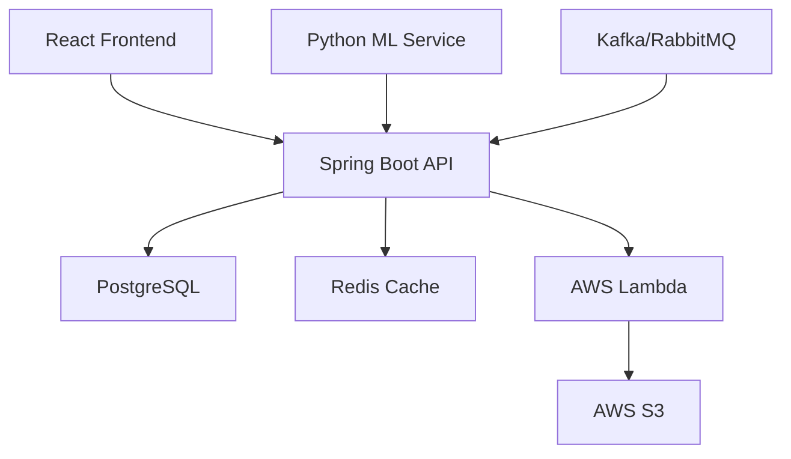

# 🏦 Fraud Detection System

A comprehensive, real-time fraud detection system built with Spring Boot and React. This system helps financial institutions detect and prevent fraudulent transactions using rule-based detection, machine learning, and real-time monitoring.


## 🚀 Overview

The Fraud Detection System is designed to identify suspicious financial transactions in real-time using multiple detection strategies. It provides a comprehensive dashboard for bank employees and administrators to monitor, investigate, and resolve potential fraud cases.

### Key Features
- 🔍 **Real-time Fraud Detection** - Multiple detection scenarios
- 👥 **Role-based Access Control** - Admin, Bank Officer, Customer
- 📊 **Interactive Dashboard** - Visual analytics and reporting
- 🚨 **Automated Alerts** - Email/SMS notifications
- ⚡ **Event-driven Architecture** - AWS Lambda integration
- 🔒 **Secure Authentication** - JWT with Spring Security

## 🏗️ Architecture



## 🛠️ Technology Stack

### Backend
- **Java 17** - Primary programming language
- **Spring Boot 3.2** - Application framework
- **Spring Security** - Authentication & Authorization
- **Spring Data JPA** - Database operations
- **Hibernate** - ORM
- **JWT** - Token-based authentication
- **PostgreSQL** - Primary database
- **Redis** - Caching & session management

### Frontend
- **React 18** - UI framework
- **TypeScript** - Type safety
- **Redux Toolkit** - State management
- **Material-UI** - Component library
- **Chart.js** - Data visualization

### DevOps & Cloud
- **AWS EC2** - Application hosting
- **AWS S3** - File storage
- **AWS Lambda** - Serverless functions
- **Docker** - Containerization
- **Terraform** - Infrastructure as Code
- **GitHub Actions** - CI/CD Pipeline

### Machine Learning
- **Python** - ML models
- **scikit-learn** - Fraud detection algorithms
- **Flask** - ML service API

## 📋 Project Status

### ✅ **Completed Features**
- [x] Spring Boot backend setup
- [x] JWT Authentication with bcrypt
- [x] User registration and login
- [x] Basic project structure with 3-layer architecture
- [x] PostgreSQL database configuration
- [x] Basic entity models (User, Role)

### 🚧 **In Development** (Current Sprint)
- [ ] Role-based authorization (Admin, Officer, Customer)
- [ ] Transaction submission API
- [ ] Basic fraud detection rules
- [ ] Fraud case management
- [ ] React frontend dashboard
- [ ] AWS infrastructure setup

### 📅 **Upcoming Features**
- [ ] Advanced fraud detection scenarios
- [ ] Real-time notifications
- [ ] Machine learning integration
- [ ] Comprehensive reporting dashboard
- [ ] Batch processing for historical data
- [ ] Email/SMS alert system

## 🎯 MVP Scope

### 1. Transaction Submission
- Users can submit transactions manually via form
- Demo credit card information for testing
- Real-time fraud detection during submission

### 2. Fraud Detection
- Rule-based fraud detection scenarios
- Flag suspicious transactions automatically
- Multiple detection strategies

### 3. Bank Officer Dashboard
- View flagged transactions
- Approve or reject transactions
- Case management interface

### 4. Admin Analytics
- Comprehensive data visualization
- Statistical reports and charts
- System monitoring

### 5. Role-based Access
- **Admin**: Full system access + analytics
- **Officer**: Fraud case management
- **Customer**: Transaction history + personal alerts

## 🗄️ Database Setup

### Initial Data Setup

Create a `data.sql` file in `src/main/resources/`:

```sql
-- Insert roles
INSERT INTO roles (name) VALUES ('ROLE_ADMIN'), ('ROLE_OFFICER'), ('ROLE_CUSTOMER');

-- Create admin user: username=admin password=password (bcrypt encoded)
INSERT INTO users (id, username, password, email, enabled, created_at)
VALUES (1, 'admin', '$2a$10$yJf9vZqg3e0oH3L6g1cG9eWqWqz7YhO2QZbJ1fOQeZk2v5z0wqM6a', 'admin@example.com', true, NOW());

-- Map admin to role
INSERT INTO user_roles (user_id, role_id)
SELECT u.id, r.id FROM users u, roles r WHERE u.username='admin' AND r.name='ROLE_ADMIN';
```

### For IntelliJ Community Edition Users

Since IntelliJ Community doesn't automatically execute `data.sql`, you can:

1. **Use PostgreSQL CLI:**
```bash
psql -U your_username -d your_database -f src/main/resources/data.sql
```

2. **Or add to `application.yml`:**
```yaml
spring:
  sql:
    init:
      mode: always
  jpa:
    defer-datasource-initialization: true
```

## 🚀 Quick Start

### Prerequisites
- Java 17 or higher
- PostgreSQL 15+
- Node.js 18+
- Maven 3.6+

### Backend Setup

1. **Clone the repository**
```bash
git clone https://github.com/your-username/fraud-detection-system.git
cd fraud-detection-system
```

2. **Configure database**
```bash
# Create database
createdb fraud_detection_db

# Update application properties
cp src/main/resources/application.example.yml src/main/resources/application.yml
```

3. **Configure `application.yml`**
```yaml
spring:
  datasource:
    url: jdbc:postgresql://localhost:5432/fraud_detection_db
    username: your_username
    password: your_password
  jpa:
    hibernate:
      ddl-auto: create-drop
    show-sql: true
```

4. **Run the application**
```bash
# Using Maven
mvn spring-boot:run

# Or build and run
mvn clean package
java -jar target/fraud-detection-system-1.0.0.jar
```

### Frontend Setup

1. **Navigate to frontend directory**
```bash
cd frontend
```

2. **Install dependencies**
```bash
npm install
```

3. **Start development server**
```bash
npm start
```

The application will be available at:
- Backend: http://localhost:8080
- Frontend: http://localhost:3000

## 🔐 Default Login Credentials

| Role | Username | Password | Access |
|------|----------|----------|---------|
| Admin | admin | password | Full system access |
| Officer | officer1 | password | Fraud case management |
| Customer | customer1 | password | Personal transactions |

## 🏗️ AWS Infrastructure

### Terraform Setup

1. **Initialize Terraform**
```bash
cd terraform
terraform init
```

2. **Plan infrastructure**
```bash
terraform plan
```

3. **Apply configuration**
```bash
terraform apply
```

### AWS Services Used
- **EC2**: Host Spring Boot application
- **S3**: Store transaction logs and reports
- **Lambda**: Process real-time fraud alerts
- **RDS**: PostgreSQL database
- **ElastiCache**: Redis for caching

## 🔧 Development

### API Endpoints

| Method | Endpoint | Description | Access |
|--------|----------|-------------|---------|
| POST | `/api/auth/login` | User login | Public |
| POST | `/api/transactions` | Submit transaction | Customer |
| GET | `/api/fraud-cases` | List fraud cases | Officer |
| PUT | `/api/fraud-cases/{id}` | Resolve case | Officer |
| GET | `/api/admin/analytics` | System analytics | Admin |

### Code Structure
```
src/
├── main/
│   ├── java/com/fraud/
│   │   ├── controller/     # REST controllers
│   │   ├── service/        # Business logic
│   │   ├── repository/     # Data access
│   │   ├── model/          # Entities and DTOs
│   │   ├── security/       # Auth configuration
│   │   └── config/         # Application config
│   └── resources/
│       └── application.yml
└── test/                   # Unit tests
```

## 🧪 Testing

### Backend Tests
```bash
mvn test
```

### Frontend Tests
```bash
cd frontend
npm test
```

### Integration Tests
```bash
mvn verify
```

## 📊 Fraud Detection Scenarios

The system currently detects:

1. **Invalid Check Applications**
   - Invalid account numbers
   - Signature mismatches
   - Suspicious amounts

2. **Card-based Fraud**
   - Locked/stolen card transactions
   - Over-limit transactions
   - Flagged card activity

3. **Behavioral Anomalies**
   - Unusual geographic locations
   - Odd transaction times
   - Spending pattern changes

## 🤝 Contributing

1. Fork the repository
2. Create a feature branch (`git checkout -b feature/amazing-feature`)
3. Commit your changes (`git commit -m 'Add amazing feature'`)
4. Push to the branch (`git push origin feature/amazing-feature`)
5. Open a Pull Request

## 📝 License

This project is licensed under the MIT License - see the [LICENSE](LICENSE) file for details.

## 🆘 Support

For support, please:
1. Check the [documentation](docs/)
2. Open an [issue](https://github.com/your-username/fraud-detection-system/issues)
3. Contact the development team

## 📞 Contact

Project Maintainer: [Your Name](mailto:your.email@example.com)

Project Link: [https://github.com/your-username/fraud-detection-system](https://github.com/your-username/fraud-detection-system)

---

**⭐ Don't forget to star this repository if you find it helpful!**

---

<div align="center">

### 🚀 **Built with ❤️ using Spring Boot & React**

*Part of Modern Banking Security Solutions*

</div>
